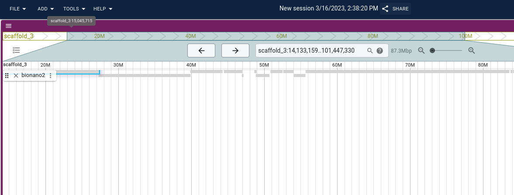

# jbrowse-plugin-bionano

WIP plugin for displaying bionano data.

After this experiment, I think bionano data should be transformed into a SAM/BAM/CRAM or PAF style format instead of using this technique. Contact me if there are any questions.

## Note

Uses some code from https://github.com/bionanogenomics/JBrowsePlugin/ licensed
MIT

## Screenshots

